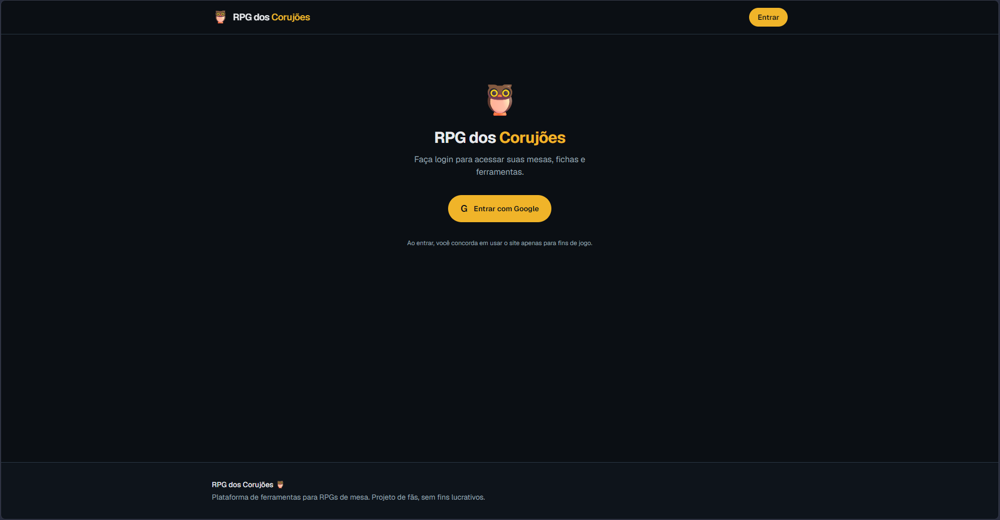
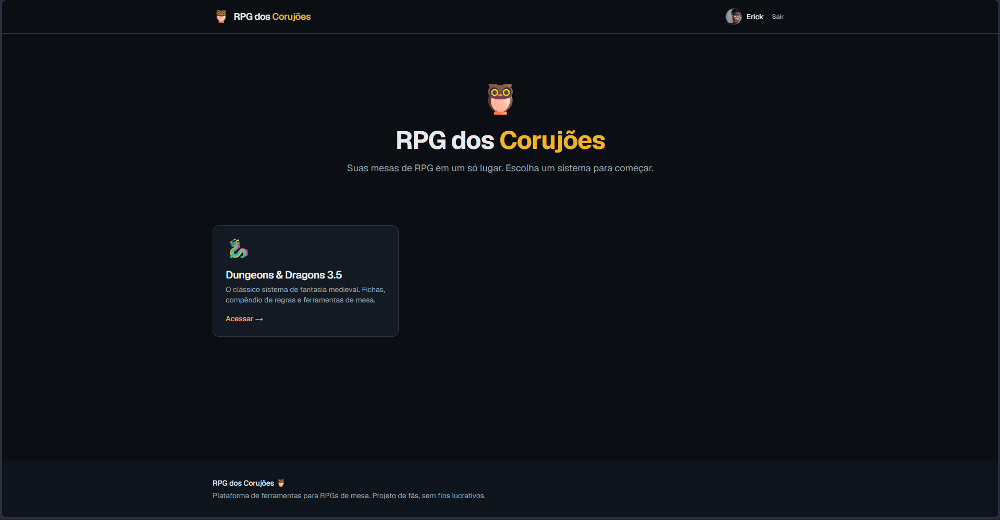
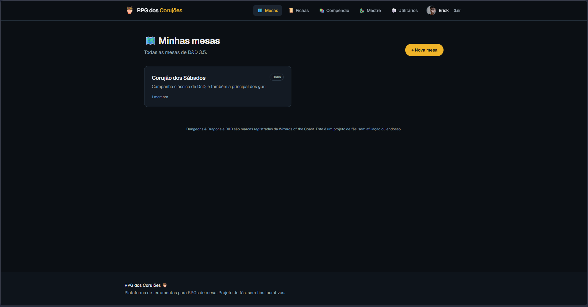

# 🎲 RPG dos Corujões

> Plataforma web para grupos de RPG de mesa gerenciarem campanhas, personagens e material de jogo em um só lugar. Nasceu para o meu próprio grupo — os Corujões — e continua evoluindo com uso real.


🌐 **Demo:** [rpg-dos-corujoes.vercel.app](https://rpg-dos-corujoes.vercel.app)

---

## 📸 Preview

| Login | Seleção de sistema | Mesas |
|---|---|---|
|  |  |  |
| Login com Google | Escolha de sistema de RPG | Gestão de mesas do usuário |

Fluxo real: login com Google → escolha do sistema de RPG → gestão das mesas do usuário.

---

## ✨ O que faz hoje

- 🔐 **Autenticação Google** via Auth.js v5, com sessões persistidas no PostgreSQL
- 🎯 **Multi-sistema por design** — arquitetura pronta para múltiplos sistemas de RPG (D&D 3.5 implementado; outros virão)
- 🎲 **Sistema de mesas (campanhas)** — criar, listar, gerenciar membros
- 👥 **Papéis por mesa** — mestre e jogador atribuídos independentemente do papel global no site
- 🔎 **Adicionar membros via busca por nome** (autocomplete), não precisa saber o e-mail
- 📋 **Ficha de personagem completa** de D&D 3.5 — atributos, combate, resistências, as 35 perícias do SRD com total calculado automaticamente, armas, talentos, equipamento, dinheiro e magias
- 🐉 **Painel do mestre** — visão consolidada das fichas da mesa: PV, CA, iniciativa, resistências e os totais das perícias que o mestre rola em segredo
- 🔗 **Vinculação ficha ↔ mesa** — cada jogador entra na mesa com sua ficha
- 🎯 **Rolador de dados** — expressões como `2d6+1d4+2`, detalhe de cada dado, destaque de 20/1 natural e histórico da sessão
- 📚 **Compêndio integrado** — acesso direto aos livros oficiais do sistema
- 🛡️ **Papel global OWNER/USER** — dono do site promovido automaticamente por variável de ambiente

## 🚧 Em desenvolvimento

Projeto em fase ativa — funcionalidades chegam conforme o grupo usa e pede.

**Próximo:**
- [ ] Dados estruturados de raças, classes e magias (não só links)
- [ ] Compartilhamento de ficha via link público
- [ ] Rastreador de iniciativa e combate no painel do mestre
- [ ] Suporte a novos sistemas além de D&D 3.5

---

## 🛠️ Stack

**Framework**
- [Next.js 16](https://nextjs.org) (App Router, Server Actions)
- [React 19](https://react.dev)
- [TypeScript 5](https://www.typescriptlang.org)

**Backend & Dados**
- [Prisma 7](https://www.prisma.io) + adapter PostgreSQL
- [Neon](https://neon.tech) — PostgreSQL serverless
- Server Actions do Next para mutations

**Autenticação**
- [Auth.js v5](https://authjs.dev) (NextAuth) com provider Google
- Sessões em banco via adaptador Prisma
- Proxy customizado (`proxy.ts`) como gate de rotas protegidas

**UI**
- [Tailwind CSS 4](https://tailwindcss.com)

---

## 🏗️ Arquitetura

```
app/
├── entrar/                      # Login
├── dnd35/                       # Namespace do sistema D&D 3.5
│   ├── mesas/                   # Campanhas
│   │   ├── nova/                # Criar mesa
│   │   └── [id]/                # Detalhe da mesa
│   ├── fichas/                  # Personagens
│   │   ├── nova/                # Criar ficha
│   │   └── [id]/                # Editar ficha
│   ├── compendio/               # Biblioteca de livros
│   ├── mestre/                  # Área do mestre
│   └── utilitarios/             # Ferramentas de mesa
└── api/
    ├── auth/[...nextauth]/      # Auth.js
    └── usuarios/
        ├── buscar/              # Autocomplete de usuários
        └── fichas/              # API de fichas
```

**Escolhas de design que importam:**

- **Autorização em dois níveis** — papel global (`OWNER`/`USER`) na tabela `User` + papel por mesa (`MESTRE`/`JOGADOR`) em `MembroMesa`. Separação intencional: quem é mestre em uma mesa pode ser jogador em outra.
- **Rotas prefixadas por sistema** (`/dnd35/*`) — adicionar Tormenta20 ou outro sistema é criar o namespace irmão, sem quebrar o que existe.
- **Proxy em vez de middleware padrão** — checagem otimista de cookie de sessão. Autorização "de verdade" (o que cada papel pode ver/editar) vive junto aos dados.
- **Ficha desacoplada da mesa** — uma ficha pertence ao usuário e é vinculada à mesa via `MembroMesa`. Permite portar personagem entre campanhas.

---

## 🚀 Rodando localmente

**Requisitos:** Node.js 20+, PostgreSQL (local ou Neon), conta Google Cloud para OAuth.

```bash
# 1. Clone e instale
git clone https://github.com/ErickRomeiro/rpg-dos-corujoes.git
cd rpg-dos-corujoes
npm install

# 2. Configure variáveis de ambiente
cp .env.example .env.local
# Preencha .env.local com:
#   DATABASE_URL         → Connection string do Postgres (Neon ou local)
#   AUTH_SECRET          → openssl rand -base64 32
#   AUTH_GOOGLE_ID       → Client ID do Google Cloud
#   AUTH_GOOGLE_SECRET   → Client Secret do Google Cloud
#   OWNER_EMAILS         → Seu e-mail (vira OWNER automaticamente)

# 3. Prepare o banco
npm run db:push

# 4. Rode em desenvolvimento
npm run dev
```

Abra [http://localhost:3000](http://localhost:3000).

**Scripts úteis:**

```bash
npm run db:generate    # Regenera Prisma Client
npm run db:push        # Sincroniza schema com o banco
npm run db:studio      # Abre Prisma Studio (GUI do banco)
```

---

## 📖 Origem

Nasceu para o meu grupo de RPG — os Corujões. A gente jogava sistemas diferentes e o vai-e-vem entre PDFs, planilhas do Google e cadernos manuscritos ficou insustentável. Este projeto é a solução prática, construída em cima do problema real e evoluída com feedback direto de quem usa.

---

## 📄 Licença

MIT — livre para usar, adaptar e aprender.

---

**Feito por [Erick Gabriel de Souza Romeiro](https://github.com/ErickRomeiro)** em Campo Grande, MS.
